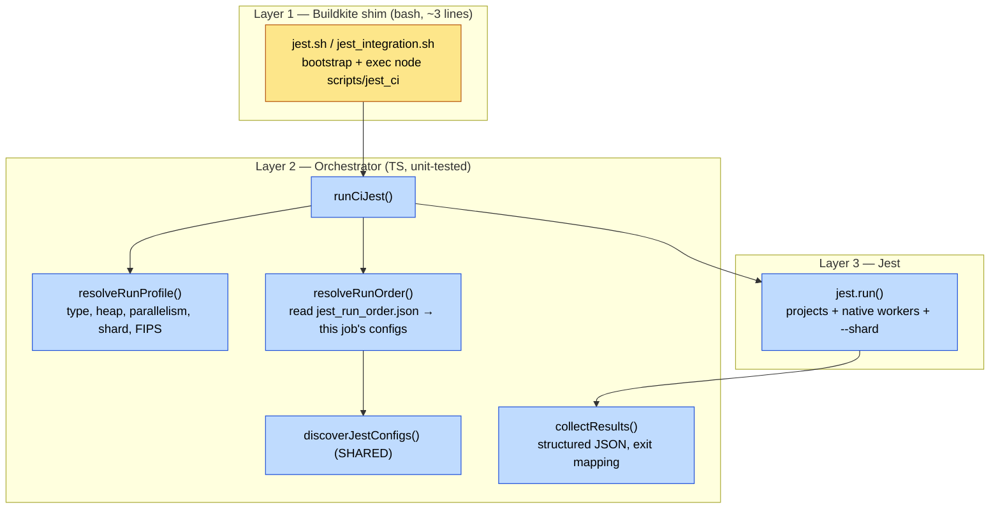

# Jest CI runner — migration plan

Bridges the [status quo](./status-quo.md) to a cleaner, testable, modern runner.
Read the status-quo doc first; this plan refers to its layers and smells.

## Goals → what changes

| Goal | Concrete change |
|---|---|
| **Readability** — ≤3 layers, one orchestration layer | Collapse `jest.sh → jest_parallel.sh → jest_all → jest → jest.run()` (5 layers) into **shim → JS orchestrator → Jest** (3). Bash keeps only Buildkite plumbing. |
| **Testability** — orchestration in JS | All decision logic (env tuning, run-order slicing, grouping, sharding, exit mapping) lives in unit-tested TS modules. No logic in bash. |
| **Negative testing** | Ship failing fixtures + a harness self-test asserting failures are surfaced (non-zero exit + structured report). Guards every known failure-suppression point. |
| **Simplification** | One config-discovery impl (not 3); one parallelism mechanism (not spawn-pool + `--runInBand`); one checkpoint site; structured results instead of stdout scraping. |
| **Modernization** | Jest 29.7 → 30; evaluate `@swc` transform (already a dep); lean on Jest-native `projects` + `--shard` for grouping. |

## Target architecture

Three layers, one of them a thin shim:

Same orchestrator binary runs **locally** and **on CI** — CI-only behavior
(run-order artifact, checkpoints, ci-stats) is injected via a small `CiContext`
interface, not sprinkled through the code. Phase A (`pick_test_group_run_order`)
stays but consumes the **shared** `discoverJestConfigs()` so discovery has one
implementation.

### Before → after, per component

| Concern | Status quo | Target |
|---|---|---|
| Config discovery | 3 impls (`jest_configs.ts`, `get_jest_configs.ts`, Jest) | 1 shared module, reused by Phase A + orchestrator |
| Parallelism | JS spawn-pool **and** `--runInBand` per child | Jest-native worker pool via `projects` (spike-gated; JS pool fallback) |
| Warmup / heartbeat / drain | hand-rolled in `run_all.ts` | removed (Jest owns worker lifecycle) or isolated in one tested module |
| Shell→JS handoff | `eval` of a command string | `spawn`/`exec` with argv array from JS |
| Failure detail | ANSI regex-scrape stdout | structured results from a JSON reporter |
| Checkpoint | `buildkite-agent` subprocess ~3×/config, 2 sites | one site behind `CiContext`, or dropped if step-level retry suffices |
| Cache injection | inline-JSON rewrite in `run.ts` | config-level `cacheDirectory`, set once |
| Env tuning | `jest_parallel.sh` bash | `resolveRunProfile()` TS |

## Negative testing (failure-suppression guard)

**Why:** the harness has many silent-pass paths. Enumerated suppression risks:

- `--passWithNoTests` — a mis-targeted config matching zero tests passes.
- Checkpoint resume — a wrongly-marked config is skipped on retry.
- `set +e; eval; set -e` — a malformed command can mask a real failure.
- Empty-config filtering in discovery — real tests dropped if discovery is wrong.
- `run_all.ts` drain timeout — truncates output (detail loss).
- Scout upload `--dontFailOnError`.
- exit-code remap (`→ 10`) — any path that loses the non-zero code.

**Design:**

1. **Fixtures**: `__harness_fixtures__/` with configs whose tests are
   *expected to fail* (a failing assertion, a throwing config, a zero-test
   config, a timeout). Excluded from normal discovery via the disabled list.
2. **Self-test**: a Jest/integration test of the orchestrator that runs each
   fixture through `runCiJest()` in-process and asserts:
   - failing test → non-zero exit **and** the failure appears in the structured
     report with the right file/name;
   - zero-test config → surfaced as an explicit outcome, not a silent pass;
   - checkpoint-skipped config → still counted, never masks a later failure.
3. **CI wiring**: run the self-test as its own fast Buildkite step so a
   regression in failure propagation blocks merge. Invert the assertion — the
   step **fails if the fixtures pass**.

This makes "does the harness actually fail when it should?" a first-class,
continuously-verified property.

## Modernization

- **Jest 30**: separate track (all `@jest/*` are pinned to 29.7 across many
  packages). Improved memory/perf and better `projects` behavior directly enable
  the single-invocation simplification. Do it *behind* the new harness so the
  harness change and the version bump are independently revertible.
- **Transforms**: `@swc/core` is already a dependency; today transforms go
  through Babel (`jest-preset.js`). Evaluate an swc-based transform for a large
  cold-start/CPU win. Gate on snapshot/output parity.
- **Grouping/sharding**: keep using ci-stats bin-packing for *step count*, but
  push per-job grouping onto Jest `projects` + native `--shard` (already used
  locally in `jest.config.dev.js`) instead of the custom pool.
- **Out of scope** (call out explicitly): switching runners (vitest, etc.) — too
  large; the win here is consolidation + a minor-version Jest bump.

## Phased rollout

Each phase is independently shippable, parity-checked, and keeps the negative
test green. No phase changes test *results*, only *how* they're run.

### Phase 0 — Guardrails (no behavior change)
- Land negative-test fixtures + harness self-test against the **current** runner
  (establishes the safety net before refactoring).
- Add a structured JSON results reporter; keep stdout scraping temporarily.
- Capture baseline metrics: per-config durations, config counts per job, total
  wall time, peak memory — for later parity comparison.

### Phase 1 — Collapse execution into JS
- New `scripts/jest_ci` (TS) that reproduces `jest_parallel.sh` behavior:
  resolve profile, download/slice run order, run configs, map exit code.
- `jest.sh` / `jest_integration.sh` shrink to `bootstrap + exec node scripts/jest_ci`.
- Delete the `eval` string handoff. Unit-test `resolveRunProfile` /
  `resolveRunOrder` / exit mapping.
- Parity gate: same configs per job, same pass/fail, comparable duration.

### Phase 2 — Unify discovery + results
- Extract one `discoverJestConfigs()` used by Phase A and the orchestrator;
  delete the duplicate impl.
- Switch failure reporting to the structured reporter; delete `parseFailedTests`
  and stdout scraping.
- Move checkpointing behind `CiContext` (single site).

### Phase 3 — Simplify the runner core (spike-gated)
- Spike: run a job's configs as one Jest invocation with `projects` + native
  worker pool + `--shard`. Measure memory/isolation vs today.
- **If viable**: delete the spawn-pool, warmup, heartbeat, drain logic, and the
  per-config Node re-boot. This is the biggest simplification.
- **If not** (memory/isolation regressions): keep a lean, unit-tested JS
  worker-pool module — still 3 layers, still JS, but no bash and no
  reimplemented Jest internals.

### Phase 4 — Modernize
- Jest 30 upgrade behind the new harness; re-run parity + negative tests.
- swc transform evaluation as an opt-in flag; promote if parity holds.

### Phase 5 — Cleanup
- Remove dead scripts, update `status-quo.md`, fold learnings into this doc.

## Risks & open questions

- **Memory**: separate-process `--runInBand` likely exists to bound per-config
  memory and isolate leaks. The Phase 3 spike must prove Jest 30 workers hold up
  on the heaviest configs before we delete the pool.
- **Checkpoints**: are per-config checkpoints still needed, or does Buildkite
  step-level retry + faster jobs make them removable? Decide in Phase 2.
- **Sharding semantics**: confirm `projects` + `--shard` shards *across* projects
  the way ci-stats expects, so duration tracking per shard stays accurate.
- **ci-stats reporter coupling**: the ci-stats/junit/scout reporters read
  `TEST_GROUP_TYPE_*` and shard annotations; keep those stable across the move.
- **Local/CI divergence**: the `CiContext` seam must be the *only* place CI
  behavior differs, or we recreate today's sprawl.

## Success criteria

- Execution path is ≤3 layers; no test logic in bash.
- Orchestration decisions are covered by unit tests.
- Negative-test step is green (fails when fixtures pass) and wired into CI.
- One config-discovery implementation.
- Parity: identical pass/fail set and no material duration/memory regression.
