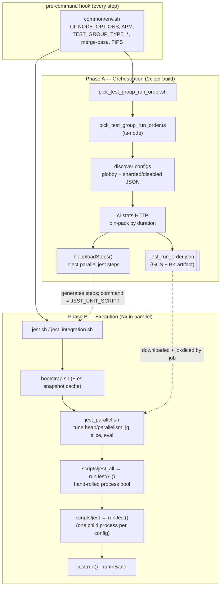
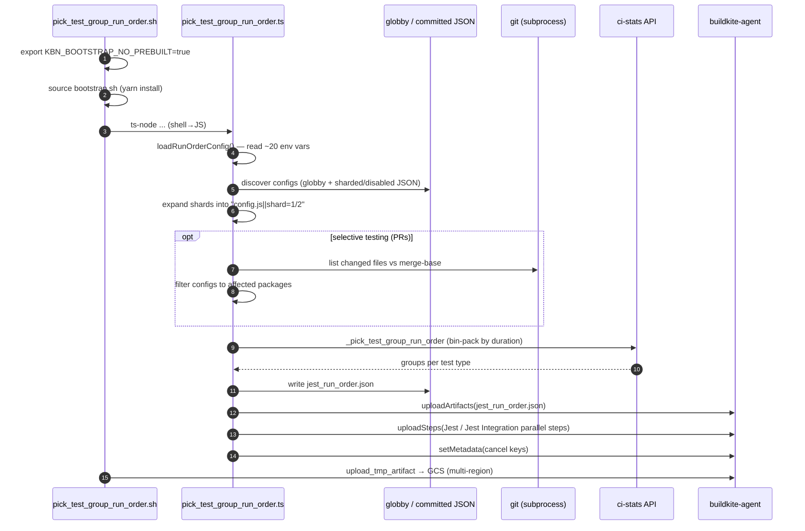
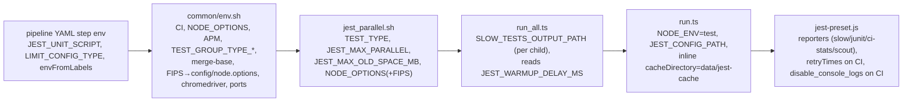
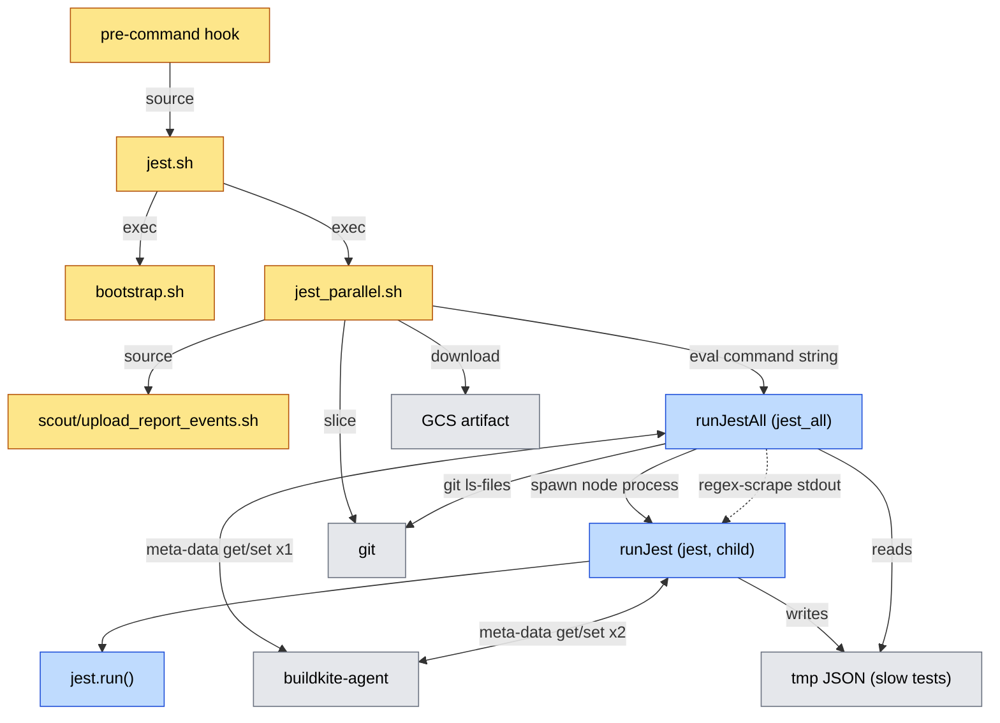
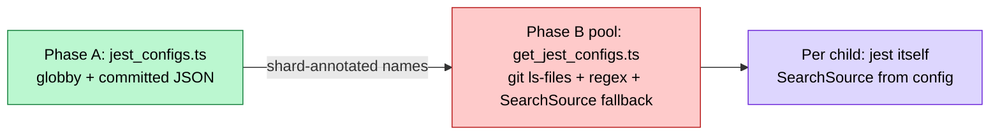

# Jest CI runner — status quo

How Jest unit/integration tests run in CI **today**. This is a reference for the
runner refactor: it documents the flow, every place we set up environment, and
every boundary crossing (shell↔shell, shell↔JS, JS↔JS, JS↔subprocess).

The harness is split into **two phases** that share state only through an
artifact (`jest_run_order.json`), Buildkite meta-data, and a couple of committed
JSON files.

| Phase | Runs | Entry point |
|---|---|---|
| A — Orchestration | once per build | `.buildkite/scripts/steps/test/pick_test_group_run_order.sh` |
| B — Execution | once per parallel job | `.buildkite/scripts/steps/test/jest.sh` / `jest_integration.sh` |

## High-level flow



The seam between phases is loose on purpose: Phase A only decides *how many
parallel jobs* and *which configs each job runs*; Phase B is handed a config
list and figures out the rest again from scratch.

## Phase A — Orchestration



Key detail: the generated step's `command` is a **string** taken from the
`JEST_UNIT_SCRIPT` / `JEST_INTEGRATION_SCRIPT` env vars, which are set in each
pipeline's YAML (e.g. `pipelines/pull_request/base.yml`). So the wiring is
`pipeline YAML → orchestrator env → generated step command → Phase B script`.

## Phase B — Execution

```mermaid
sequenceDiagram
  autonumber
  participant JSH as jest.sh
  participant PSH as jest_parallel.sh
  participant GCS as GCS / buildkite artifact
  participant JQ as jq
  participant ALL as runJestAll() (jest_all)
  participant CFG as getJestConfigs()
  participant GIT as git (subprocess)
  participant BK as buildkite-agent
  participant ONE as runJest() (child process)
  participant J as jest.run()

  JSH->>JSH: is_test_execution_step (BK meta-data)
  JSH->>JSH: bootstrap.sh (+ es snapshot cache for integration)
  JSH->>PSH: jest_parallel.sh jest.config.js
  PSH->>PSH: set TEST_TYPE, JEST_MAX_PARALLEL, heap, NODE_OPTIONS(+FIPS)
  PSH->>GCS: download_tmp_artifact jest_run_order.json
  PSH->>JQ: slice groups[BUILDKITE_PARALLEL_JOB].names
  PSH->>ALL: eval "node scripts/jest_all --configs=CSV ..." (shell→JS)
  ALL->>CFG: re-discover configs (drop empty, re-attach shards)
  CFG->>GIT: git ls-files (again) + Jest SearchSource fallback
  loop each config (up to maxParallel)
    ALL->>BK: isConfigCompleted() — meta-data get (checkpoint)
    ALL->>ONE: spawn(node scripts/jest --config X --runInBand) (JS→JS)
    ONE->>BK: isConfigCompleted() again (checkpoint)
    ONE->>ONE: rewrite config to inline JSON + inject data/jest-cache
    ONE->>J: jest.run(inline config)
    J-->>ONE: exit code
    ONE->>BK: markConfigCompletedSync() on exit (checkpoint write)
    ONE-->>ALL: stdout/stderr (buffered)
    ALL->>ALL: ANSI-strip + regex-scrape failed tests
    ALL->>BK: markConfigCompleted() for passing configs
  end
  ALL->>ALL: cli-table3 summary; exit 10 on any failure
  PSH->>PSH: map failure → exit 10
  PSH->>PSH: source scout/upload_report_events.sh
```

### Warmup / pool behaviour (`run_all.ts`)

`runJestAll` reimplements a parallel pool because each child runs
`--runInBand` (Jest's own worker pool is disabled per process):

- **Warmup**: start 1 process for up to `JEST_WARMUP_DELAY_MS` (default 120s) to
  warm the shared Babel transform cache, then ramp to `JEST_MAX_PARALLEL`.
- **Heartbeat**: log progress every 60s.
- **Output capture**: manual stdout/stderr buffering with a 3s drain timeout
  after `exit`, then ANSI-stripping regex to extract failed test names.
- **Checkpoint resume**: skip configs that already passed on a prior attempt.

## Environment setup — where it happens

Env is layered across five places, each adding or rewriting values:



| Layer | File | Notable values |
|---|---|---|
| Pipeline YAML | `pipelines/**/*.yml` | `JEST_UNIT_SCRIPT`, `JEST_INTEGRATION_SCRIPT`, `LIMIT_CONFIG_TYPE`, `LIMIT_SOLUTIONS`, label-derived env |
| Global env | `scripts/common/env.sh` | `CI`, `NODE_OPTIONS`, `ELASTIC_APM_*`, `TEST_GROUP_TYPE_*`, merge-base, FIPS append to `config/node.options` |
| Dispatch | `scripts/steps/test/jest_parallel.sh` | `TEST_TYPE`, `JEST_MAX_PARALLEL`, `JEST_MAX_OLD_SPACE_MB`, rebuilds `NODE_OPTIONS` |
| Pool | `kbn-test/src/jest/run_all.ts` | `SLOW_TESTS_OUTPUT_PATH` per child, `JEST_WARMUP_DELAY_MS` |
| Per-config | `kbn-test/src/jest/run.ts` | `NODE_ENV=test`, `JEST_CONFIG_PATH`, inline `cacheDirectory` |
| Jest config | `kbn-test/jest-preset.js` | reporters gated on env, `retryTimes` on CI, `disable_console_logs` on CI |

## Boundary crossings



### Crossing inventory

- **shell → shell**: hook → step → bootstrap → `jest_parallel` → scout upload
  (4+ sourced/exec hops; `set -e` semantics reset at each).
- **shell → JS via `eval`**: `jest_parallel.sh` builds `NODE_OPTIONS=... node
  ./scripts/jest_all ...` as a string and `eval`s it — the most fragile seam
  (quoting, heap flags, FIPS all string-concatenated).
- **JS → JS via `spawn`**: `run_all.ts` spawns one `scripts/jest` child per
  config — a full second Node boot + re-`setup-node-env` + re-config-discovery
  per config.
- **JS ↔ buildkite-agent**: checkpoint read/write shells out to
  `buildkite-agent` **~3× per config** (pool pre-check, child pre-check, child
  exit write).
- **JS ↔ git**: config discovery runs `git ls-files` subprocesses in **both**
  phases, independently.
- **JS ↔ filesystem (out-of-band)**: slow tests passed child→parent through tmp
  JSON files; **failed tests passed child→parent by regex-scraping stdout**.
- **Cross-phase**: Phase A → Phase B communicate only via `jest_run_order.json`
  plus shard annotations encoded as `||shard=` strings (parsed in ≥3 places).

## Config discovery happens 3+ times



Three different implementations answer "which tests does this config run?" — a
prime target for consolidation.

## Smells worth flagging for the refactor

1. **Config discovery runs 3+ times** with three different implementations.
2. **Two parallelism layers**: `run_all.ts` spawns processes but forces
   `--runInBand`, so Jest's worker pool is disabled and reimplemented by hand
   (warmup, heartbeat, drain-timeout, output buffering).
3. **Shard annotation as a string protocol** (`||shard=`) parsed/re-parsed in
   `jest_configs.ts`, `run_all.ts`, `run.ts`, `shard_config.ts`,
   `ci_stats_jest_reporter.ts`.
4. **Checkpoint via `buildkite-agent` subprocess** per config, duplicated in
   `run_all.ts` and `run.ts`.
5. **Failure detail via stdout regex scraping** in `run_all.ts`
   (`parseFailedTests`) — brittle and ANSI-dependent — while a junit reporter
   already emits structured results.
6. **`eval` of a command string** in `jest_parallel.sh` instead of an argv array.
7. **Inline-JSON config rewrite** in `run.ts` purely to inject `cacheDirectory`.

## File index

| Concern | File |
|---|---|
| Phase A entry | `.buildkite/scripts/steps/test/pick_test_group_run_order.sh` |
| Phase A orchestrator | `.buildkite/pipeline-utils/ci-stats/pick_test_group_run_order/*.ts` |
| Phase B unit entry | `.buildkite/scripts/steps/test/jest.sh` |
| Phase B integration entry | `.buildkite/scripts/steps/test/jest_integration.sh` |
| Phase B dispatch | `.buildkite/scripts/steps/test/jest_parallel.sh` |
| Global env | `.buildkite/scripts/common/env.sh` |
| Shared shell fns | `.buildkite/scripts/common/util.sh` |
| Multi-config pool | `src/platform/packages/shared/kbn-test/src/jest/run_all.ts` |
| Single-config runner | `src/platform/packages/shared/kbn-test/src/jest/run.ts` |
| Config discovery (Phase B) | `src/platform/packages/shared/kbn-test/src/jest/configs/get_jest_configs.ts` |
| Checkpoint helpers | `src/platform/packages/shared/kbn-test/src/jest/buildkite_checkpoint.ts` |
| Shard helpers | `src/platform/packages/shared/kbn-test/src/jest/shard_config.ts` |
| Slow-test reporter | `src/platform/packages/shared/kbn-test/src/jest/slow_test_reporter.js` |
| Jest preset | `src/platform/packages/shared/kbn-test/jest-preset.js` |
| Shard map (input) | `.buildkite/sharded_jest_configs.json` |
| Disabled configs (input) | `.buildkite/disabled_jest_configs.json` |
